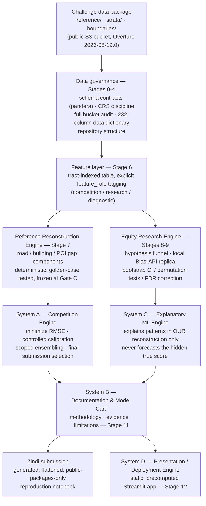

# Bias Bounty: Mapping Equity Challenge

**Are the communities most exposed to climate risk also the least well-mapped — in the exact data emergency dispatch, evacuation routing, and disaster relief actually rely on?**

[](https://www.python.org/)
[](#testing--quality-assurance)
[](#project-status)
[](#engineering-discipline-the-five-gate-control-structure)
[](#data-sources)
[](#author)

**Author:** Henry Otsyula

Solution repository for Zindi's *Bias Bounties @ Scale: Mapping Equity Challenge*, hosted by
Humane Intelligence and Reliabl in partnership with Radiant Earth, supported by the
Heising-Simons Foundation.

---

## Table of contents

- [The problem](#the-problem)
- [Why this isn't "just another Kaggle-style model"](#why-this-isnt-just-another-kaggle-style-model)
- [System architecture](#system-architecture)
- [The four study regions](#the-four-study-regions)
- [Engineering discipline: the five-gate control structure](#engineering-discipline-the-five-gate-control-structure)
- [Repository structure](#repository-structure)
- [Data sources](#data-sources)
- [Getting started](#getting-started)
- [Project status](#project-status)
- [Testing & quality assurance](#testing--quality-assurance)
- [Documentation](#documentation)
- [Tech stack](#tech-stack)
- [Author](#author)

---

## The problem

Open, crowdsourced map data — Overture Maps, the successor to the OpenStreetMap-derived data most
emergency-response systems already lean on — is not uniformly complete. Roads, buildings, and
critical facilities (fire stations, EMS, schools) are better-mapped in some places than others, and
that unevenness is not random. When a wildfire corridor, a drought-stressed tribal statistical
area, or a high-heat-vulnerability urban tract turns out to also be a *coverage-gap* tract — a
place where the map data dispatch and routing systems rely on simply doesn't reflect the roads and
facilities that actually exist — the consequence isn't an abstract data-quality footnote. It's a
fire truck routed around a road that was never digitized, or a rescue team with no record that a
clinic exists three blocks away.

This project quantifies that gap directly. For 9,379 Census tracts across four climate-stressed US
regions, it reconstructs a **coverage gap score** — how completely Overture Maps covers the roads,
buildings, and critical facilities that four authoritative government reference sources confirm
actually exist — and then asks the harder question the automated scorecard alone can't answer:
*does that gap fall disproportionately on the communities already most exposed to heat, wildfire,
drought, and social vulnerability?*

## Why this isn't "just another Kaggle-style model"

There is no ground-truth label here to fit a model against. The competition organizers computed a
reference coverage-gap score for every tract and kept it hidden; every submission is scored by RMSE
against that unseen number, and the only feedback available is one noisy aggregate scalar per
upload, against a fixed 300-submission budget. That single fact reshapes the entire engineering
approach:

- The core pipeline is not "trained" — it's a **deterministic reconstruction** of a specific,
  hidden computation the organizers already ran once. This project names it accordingly (the
  **Reference Reconstruction Engine**) rather than calling it a model, because "model" invites
  hyperparameter-tuning instincts that simply don't apply to reverse-engineering a fixed
  specification.
- Validation happens through **golden-case fixtures** (hand-constructed micro-tracts with
  manually verified expected outputs) and a **designed-experiment calibration protocol**
  (holding three regions fixed, varying one candidate rule in the fourth, attributing the RMSE
  delta to exactly that change) — not a held-out test split, because none exists.
- Repeatedly querying the public leaderboard to compare candidate formulas is itself treated as a
  noisy measurement process requiring its own statistical discipline (an empirical noise floor,
  mandatory cross-region confirmation before trusting an isolated "win").
- A second, entirely separate objective — the **Bias Score**, which does not affect leaderboard
  rank at all — asks whether the reconstructed coverage gap correlates with social vulnerability,
  tribal status, or hazard exposure. Winning that prize requires a genuinely different kind of
  rigor: hypothesis pre-registration, exploration/confirmation separation, and a
  Benjamini-Hochberg false-discovery-rate correction across the small set of claims actually
  tested — the same discipline a peer-reviewed empirical paper would need, not a leaderboard
  metric.

Treating these as one undifferentiated "build the model" task is exactly the trap this project's
architecture is designed to avoid.

## System architecture

Four independently-objectived systems sit downstream of a shared data-governance and feature
layer. Keeping them conceptually and architecturally separate — rather than one monolithic
pipeline — is the single most important structural decision in this project.



**Reading it left to right by objective**: *System A* exists to minimize RMSE under a
budget-aware calibration protocol. *The Equity Research Engine* exists to discover disparity
patterns the automated five-metric scorecard structurally cannot see. *System C*, nested inside
Stage 8, exists only to explain patterns in this project's own already-computed data — never to
forecast the hidden true score, a distinction restated everywhere its output is used. *System D*
exists to make the finished results interactively explorable. Full reasoning: [`PROJECT_BLUEPRINT.md`
§0.1](PROJECT_BLUEPRINT.md).

## The four study regions

Every region below was pre-packaged by the challenge; all 9,379 scored tracts fall within them.

| Region | Scored tracts | Climate exposure |
|---|---:|---|
| Maricopa County, AZ | 1,593 | Extreme heat, drought |
| Northern California fire corridor | 591 | Wildfire |
| Eastern Oklahoma tribal statistical areas | 1,192 | Drought, heat |
| South-Central Texas (I-35 / I-37 corridor) | 6,003 | Heat, drought |
| **Total** | **9,379** | — |

The Maricopa package includes one boundary-straddling New Mexico tract (`35023970000`, Hidalgo
County Tract 9700) — confirmed directly against the live data, documented as an explicit edge case
rather than silently dropped or misattributed.

## Engineering discipline: the five-gate control structure

Rather than a loose sequence of notebooks, this project is organized around five explicit gates —
each one a hard checkpoint that later stages are not permitted to build past until it closes.

| Gate | Meaning | Status |
|---|---|---|
| **A — Data Trusted** | Every layer, every region, validated against an enforced schema contract | ✅ **Closed** |
| **B — Scorer Trusted** | Smoke-test submission accepted; published statistics reproduced from raw data; gold-standard manual validation set agrees | ⏳ Pending (Stage 7) |
| **C — Scoring Frozen** | Reference Reconstruction Engine frozen with a versioned, checksummed artifact; no further scoring-logic change without a regression test proving a defect | ⏳ Pending (Stage 7) |
| **D — Bias Discovery Frozen** | Confirmatory statistics complete, FDR-corrected, Bias-API-replica-checked for redundancy | ⏳ Pending (Stage 9) |
| **E — Code Review Ready** | Flattened, public-packages-only reproduction notebook; full documentation; clean commit history | ⏳ Ongoing discipline |

Gate A closing meant something concrete, not a checkbox: all 44 region/layer combinations across
all four regions were loaded and validated against `pandera` schema contracts in
[`src/schemas.py`](src/schemas.py), confirmed **twice independently** — once from
[`scripts/audit/audit_bucket.py`](scripts/audit/audit_bucket.py)'s command line and once from a
fully narrated notebook re-run ([`notebooks/00_data_audit.ipynb`](notebooks/00_data_audit.ipynb))
— with identical results both times.

Beyond the gates, three disciplines run throughout:

- **Schema-first, not schema-eventually.** Every table this project reads has an enforced
  `pandera` contract before a single feature is computed from it.
- **Two-tier golden-case testing**, arriving at Stage 7: hand-constructed arithmetic edge cases
  (`overture=0` → gap 1; `reference=0` → undefined, excluded from the mean, never zeroed) tested
  separately from hand-fabricated micro-geometry fixtures (a tract boundary, a straddling
  building, a crossing road) — two genuinely different failure modes, deliberately never folded
  into one generic test.
- **"Break it to prove it."** Every bug fix in this project's history follows the same discipline:
  reproduce the failure directly, write a regression test, revert the fix and confirm the new
  test fails, restore the fix and confirm the full suite passes. Nothing is called "confirmed"
  without independent reproduction first.

## Repository structure

```
bias-bounty-mapping-equity/
├── README.md                    this file
├── PROJECT_BLUEPRINT.md         stage-by-stage architecture reference — single source of truth
├── requirements.txt             pinned dependencies (see docs/reproducibility.md for every pin's rationale)
├── pyproject.toml               pytest configuration
├── Makefile                     thin cross-platform wrapper around src/cli.py
├── .gitignore
│
├── configs/                     environment-specific settings only (never region/formula constants)
│
├── src/                         reusable, tested pipeline code
│   ├── cli.py                    canonical interface — python -m src.cli --help
│   ├── config.py                 region / layer / formula / seed constants
│   ├── schemas.py                 pandera contracts, one per data layer
│   ├── io.py                     GeoParquet ingestion + type enforcement (GEOID etc. as string)
│   ├── geometry.py                CRS discipline + the sole home for spatial-assignment logic
│   ├── features.py               feature-table assembly + feature_role tagging      [Stage 6]
│   ├── gaps.py                   the Reference Reconstruction Engine itself          [Stage 7]
│   ├── statistics.py              bootstrap CI / permutation test / FDR / Moran's I  [Stage 9]
│   ├── diagnostics.py             clustering + explanatory model + HPO + SHAP        [Stage 8]
│   ├── bias_api_replica.py       local replica of the 5 official Bias Score metrics [Stage 9]
│   ├── viz.py                    shared plotting helpers
│   └── validate.py               submission validator + self-check suite            [Stage 7]
│
├── app/                         deployed Streamlit app — static-data-driven only     [Stage 12]
├── notebooks/                   00_data_audit (real) + 4 staged placeholders (01-04)
├── scripts/
│   ├── audit/audit_bucket.py     44/44 region-layer combinations, twice-confirmed
│   ├── build_data_dictionary.py  + 8 more Stage 3 data-dictionary scripts, each fully tested
│   ├── verify_bucket.py          pre-Stage-2 bucket check, deliberately kept as a live record
│   ├── download/                 [Stage 1 fallback path, placeholder]
│   └── submission/               generated-submission-notebook builders                [Stage 7]
├── submission/                  generated artifact only — never hand-edited            [Stage 7]
├── scoring/v1/                  versioned, checksummed scoring artifact                [Stage 7]
│
├── tests/                       469 passing, 2 environment-only skips
├── docs/
│   ├── data_manifest.md          the project's running log of confirmed facts (~1,900 lines)
│   ├── DATA_DICTIONARY.md        every one of 232 national-strata columns, categorized
│   ├── schema_catalog.csv        machine-readable companion to the data dictionary
│   ├── decision_log.md           why an implementation choice was made over its alternatives
│   ├── risk_register.md          dynamic risk table — ID / probability / impact / mitigation
│   ├── bias_discovery.md         Best Bias Discovery write-up (candidates scoped, not yet written)
│   ├── methodology.md · reproducibility.md · data_vintage_confirmation.md
│   └── validation/ · experiments/ · figures/
│
├── data/                         gitignored local cache — nothing here is bulk-downloaded by default
├── mlruns/ · models/             gitignored experiment-tracking store and model artifacts
└── submissions/                  gitignored except the two final selections
```

Every path above either holds real, tested code or an explicit, docstring-only placeholder naming
the stage that will populate it — never an empty file with no explanation of what belongs there.

## Data sources

All challenge data is read directly from the public Source Cooperative bucket
(`s3://us-west-2.opendata.source.coop/humane-intelligence/bias-bounty-mapping-equity-challenge/`)
as cloud-native GeoParquet — no credentials required, no bulk download by default. Overture Maps
layers are pinned to release **`2026-08-19.0`**; every computation in this repository uses that
release only.

| Source | Role |
|---|---|
| **Overture Maps** (buildings, roads, POIs, infrastructure) | The map data under evaluation |
| **Census TIGER/Line Roads** | Road-network coverage reference |
| **Microsoft US Building Footprints** | Building coverage reference |
| **USGS National Map** (via HIFLD) | Critical-facility coverage reference (fire, EMS, schools) |
| **Census County Business Patterns (CBP)** | Business-establishment coverage reference |
| **CDC Social Vulnerability Index, US Climate Vulnerability Index, tribal land boundaries, hazard data** | Equity-evaluation strata — read, never scored on |

See [`docs/data_manifest.md`](docs/data_manifest.md) for every fact about this data package
confirmed by direct verification against the live bucket — object inventories, real schemas, and
what is (and pointedly, is not) shipped.

## Getting started

```powershell
conda create -n bias-bounty python=3.11
conda activate bias-bounty
pip install -r requirements.txt
python -m src.cli --help
pytest
```

All three of the last commands succeed with zero errors from a clean clone — this is Stage 0's
exit criterion, and it's checked on every environment rebuild, not just once. See
[`docs/reproducibility.md`](docs/reproducibility.md) for the full environment record, including
the dependency-compatibility investigation behind every pin in `requirements.txt` (for example,
why `pandas` is deliberately pinned to the 2.x line against the challenge tutorial's own 3.x
environment — a verified, documented decision, not an oversight).

```powershell
# Stage 2 is real and working today:
python -m src.cli audit --region eastern-ok

# Later stages are honest, documented stubs until their turn comes:
python -m src.cli score --region eastern-ok
# -> NotImplementedError: Not yet implemented — this is Stage 7 of PROJECT_BLUEPRINT.md Section 3.
#    Expected deliverable: src/gaps.py
```

Every CLI subcommand not yet built raises a clear, stage-numbered `NotImplementedError` rather than
silently doing nothing or half-working — a deliberate choice over letting an unfinished command
fail confusingly.

## Project status

**Stages 0 through 4 complete — 4 of 13. Stage 5 (Exploratory Data Analysis) is next.**

- [x] **Stage 0** — Environment & reproducibility foundation
- [x] **Stage 1** — Data acquisition & governance
- [x] **Stage 2** — Data audit, validation contracts & catalog *(Gate A closed)*
- [x] **Stage 3** — Data dictionary (232 columns cataloged; a full second review pass found and
      fixed two real, previously-undetected bugs before Stage 4 began)
- [x] **Stage 4** — Repository restructure (this tree)
- [ ] **Stage 5** — Exploratory data analysis
- [ ] **Stage 6** — Feature engineering
- [ ] **Stage 7** — Reference Reconstruction Engine: build, test, calibrate, freeze *(Gates B & C)*
- [ ] **Stage 8** — Bias Discovery hypothesis mining & explanatory modeling
- [ ] **Stage 9** — Statistical confirmation & Bias Discovery writeup *(Gate D)*
- [ ] **Stage 10** — CI/CD
- [ ] **Stage 11** — Documentation
- [ ] **Stage 12** — Deployment (Streamlit)
- [ ] **Stage 13** — Final submission & portfolio finalization *(Gate E)*

No leaderboard score and no Bias Discovery finding exist yet — and this README says so plainly
rather than implying otherwise. What exists instead is the foundation a leaderboard score and a
defensible equity finding actually need to be trustworthy: a fully audited, schema-enforced data
layer; a complete map of what every one of 232 available columns means and whether it's legally
usable for scoring or bias analysis; and a repository shaped correctly before a single line of
scoring logic is written. See [`PROJECT_BLUEPRINT.md`](PROJECT_BLUEPRINT.md) for the full
stage-by-stage plan and every stage's exit criteria, and [`docs/decision_log.md`](docs/decision_log.md)
for the reasoning behind every structural decision made so far.

## Testing & quality assurance

**469 tests passing, 2 skipped.** The 2 skips are a single, identified, environment-specific
limitation (a sandboxed DuckDB spatial-extension download blocked by network policy) — not a gap
in coverage, and not present in this project's normal development environment.

- Every real script has a dedicated test file; every documented bug fix carries a regression test
  proven load-bearing by deliberately reverting the fix and watching the test fail first.
- `pandera` contracts validate every data layer's schema *before* any feature is computed from it,
  not after something breaks downstream.
- Two-tier golden-case fixtures (arithmetic edge cases and micro-geometry assignment, tested
  separately) will gate the Reference Reconstruction Engine before it ever touches real data —
  scaffolded now, populated at Stage 7.
- CI (GitHub Actions, running the full suite on every push) is deliberately **not** wired up yet —
  an empty CI workflow would produce a misleading green badge before there's anything real to
  check against. It ships in full at Stage 10, matching the stage that actually owns it, rather
  than being split across two disconnected steps.

## Documentation

| Document | What it covers |
|---|---|
| [`PROJECT_BLUEPRINT.md`](PROJECT_BLUEPRINT.md) | Full architecture and stage-by-stage plan — the single source of truth |
| [`docs/data_manifest.md`](docs/data_manifest.md) | Every confirmed fact, finding, and fix, stage by stage |
| [`docs/DATA_DICTIONARY.md`](docs/DATA_DICTIONARY.md) / [`schema_catalog.csv`](docs/schema_catalog.csv) | Every column of the 232-column national strata table, categorized and cross-referenced |
| [`docs/decision_log.md`](docs/decision_log.md) | Why an implementation choice was made over its alternatives |
| [`docs/risk_register.md`](docs/risk_register.md) | Live risk tracking — GEOID handling, CRS axis order, and four more, with mitigation status |
| [`docs/bias_discovery.md`](docs/bias_discovery.md) | Best Bias Discovery candidate pool and (eventually) the flagship finding |
| [`docs/methodology.md`](docs/methodology.md) | Data-access and processing pipeline, written up as results are produced |
| [`docs/reproducibility.md`](docs/reproducibility.md) | Exact environment, dependency-compatibility investigation, seeds, runtimes |

## Tech stack

| Layer | Tools |
|---|---|
| Geospatial compute | DuckDB (spatial SQL), GeoPandas, Shapely, PyArrow |
| Data contracts | pandera |
| Experiment tracking | MLflow |
| Explanatory modeling | scikit-learn, LightGBM, SHAP, Optuna |
| Testing | pytest |
| Deployment | Streamlit (Community Cloud) |
| Environment | Python 3.11, Miniconda, VS Code |

## Author

**Henry Otsyula** — Data Scientist & Machine Learning Engineer.

This repository is sole-authorship work, built and maintained end-to-end as both a competition
entry and a portfolio piece demonstrating production-grade data engineering discipline: enforced
schema contracts, gated stage progression, golden-case testing for a target with no ground truth,
and documentation treated as a first-class deliverable rather than an afterthought.
