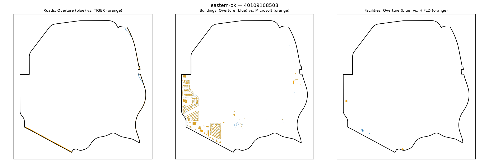

# Gold-standard validation — eastern-ok / 40109108508

**Strata**: tribal=False, rural=True, svi_high=False, water_dominated=True

**Pipeline's own computed values for this tract** (from `src.gaps.score_all_regions()`, current default `building_gap_centroid`):

| component | value | defined |
|---|---|---|
| coverage_gap_score | 0.2151 | — |
| transport_gap | 0.6452 | True |
| building_gap | 0.0000 | True |
| poi_gap | 0.0000 | True |
| poi_gap_fire | 0.0000 | True |
| poi_gap_ems | nan | False |
| poi_gap_schools | 0.0000 | True |
| poi_gap_establishments | 0.0000 | True |

## Manual visual-agreement judgment

**Roads — AGREE.** Blue (Overture) is nearly absent (one short segment, top-right); orange (TIGER) shows two distinct segments. Sparse blue vs. present orange is consistent with a high `transport_gap` (0.6452).

**Buildings — CORRECTED: my original "DISAGREE, flagged" note below was wrong, disproven by
follow-up investigation.** On first visual read I judged the orange (Microsoft) building clusters
as dense and the blue (Overture) marks as sparse, and flagged `building_gap` = 0.0000 as a likely
bug. `scripts/debug_building_gap_centroid.py` (see `docs/decision_log.md`, Stage 7 Step 9
follow-up) independently recomputed the real counts directly against the live bucket: **Overture
has 1,021 buildings in this tract vs. Microsoft's 724** — Overture actually has *more* building
coverage here, not less. `building_gap = 1 - min(1, 1021/724) = 1 - min(1, 1.41) = 0.0000` is the
formula working exactly as designed. The centroid-vs-intersecting reassignment I hypothesized as
the explanation also doesn't exist: 1,021 of 1,021 intersecting Overture buildings (100%) have
their centroid inside this exact tract, and the same for all 724 Microsoft buildings — zero
reassigned to a neighbor. My original visual impression of the map was simply mistaken, most
likely because Overture's building footprints render as thin outlines against Microsoft's filled
polygons at this map's marker/line settings, making comparable density look sparser. No pipeline
bug exists. `building_gap_centroid` is confirmed correct here by live, independent recomputation.

**Facilities — AGREE.** One orange dot (top-left) and a mixed cluster of two blue + one orange near bottom-center, plus one orange at bottom-right — rough balance between the two sources, consistent with `poi_gap` = 0.0000.

**Water-dominance context**: this tract is >50% water, explaining the sparse road/facility layout; irrelevant to the (now-resolved) building count question above.

**Action**: none needed. The building-gap investigation this note originally requested is closed —
see `docs/decision_log.md`'s Stage 7 Step 9 follow-up entry for the full investigation record.
