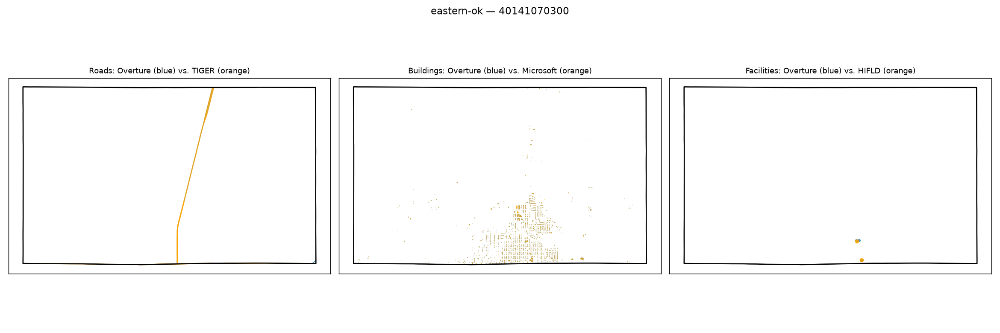

# Gold-standard validation — eastern-ok / 40141070300

**Strata**: tribal=True, rural=True, svi_high=True, water_dominated=False

**Pipeline's own computed values for this tract** (from `src.gaps.score_all_regions()`, current default `building_gap_centroid`):

| component | value | defined |
|---|---|---|
| coverage_gap_score | 0.0923 | — |
| transport_gap | 0.2755 | True |
| building_gap | 0.0013 | True |
| poi_gap | 0.0000 | True |
| poi_gap_fire | nan | False |
| poi_gap_ems | nan | False |
| poi_gap_schools | 0.0000 | True |
| poi_gap_establishments | 0.0000 | True |

## Manual visual-agreement judgment

**Roads — AGREE.** Only orange (TIGER) is visible as a clear road; a sliver of blue appears at the very bottom edge. Mostly-orange, near-absent-blue matches a moderate `transport_gap` (0.2755) — not as extreme as the 0.65 case above, and the map does show a bit more blue presence than that one.

**Buildings — AGREE.** Dense overlapping orange/blue speckle in the middle of the tract (typical small-town footprint pattern) with the two colors visually co-located rather than in separate clusters. Consistent with `building_gap` ≈ 0 (0.0013).

**Facilities — AGREE.** Two dots essentially on top of each other (orange+blue) near the bottom edge — consistent with `poi_gap` = 0.0000 for the defined categories (schools, establishments); fire/ems are correctly marked undefined (nan) rather than forced to 0, matching the "no blank cells, use defined-flag" convention.

No disagreement here — this tract looks like a clean, well-behaved example of the pipeline working as intended for a small tribal/rural tract.
