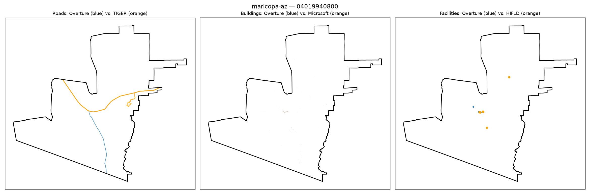

# Gold-standard validation — maricopa-az / 04019940800

**Strata**: tribal=True, rural=True, svi_high=True, water_dominated=False

**Pipeline's own computed values for this tract** (from `src.gaps.score_all_regions()`, current default `building_gap_centroid`):

| component | value | defined |
|---|---|---|
| coverage_gap_score | 0.1781 | — |
| transport_gap | 0.2842 | True |
| building_gap | 0.0000 | True |
| poi_gap | 0.2500 | True |
| poi_gap_fire | 1.0000 | True |
| poi_gap_ems | nan | False |
| poi_gap_schools | 0.0000 | True |
| poi_gap_establishments | 0.0000 | True |

## Manual visual-agreement judgment

**Roads — AGREE.** A clear orange (TIGER) route runs through the middle of the tract; a shorter, differently-routed blue (Overture) segment covers only part of it. Sparser blue than orange is consistent with a moderate `transport_gap` (0.2842).

**Buildings — AGREE (trivial case).** No buildings rendered in either color — this is a large, empty desert/tribal-land tract with essentially zero built structures. `building_gap` = 0.0000 here is the vacuous "both sides empty" case, not evidence of strong real coverage. Worth noting for the write-up: a 0.0000 building_gap on a near-empty tract is a different kind of "good" than a 0.0000 on a dense built-up tract, and the two shouldn't be read the same way in the bias analysis.

**Facilities — AGREE.** One isolated blue dot near a tight cluster of 2–3 orange dots, plus one orange dot far to the north with nothing near it. That isolated northern orange point with no Overture counterpart is exactly what `poi_gap_fire` = 1.0000 (completely missing in Overture) should look like, while the mixed cluster explains the more moderate overall `poi_gap` = 0.2500.

No disagreement — this tract is a good illustration of a real, localized fire-station gap in tribal/rural Maricopa land.
