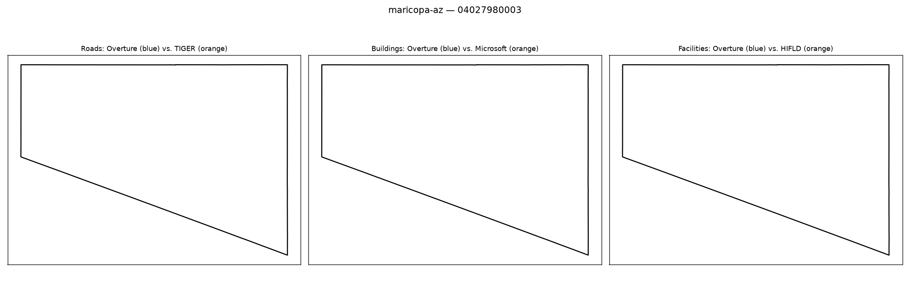

# Gold-standard validation — maricopa-az / 04027980003

**Strata**: tribal=False, rural=False, svi_high=unavailable (svi_covered=False for this tract -- consistent with it being the completely empty/unpopulated tract this note's own visual-agreement judgment already identifies below), water_dominated=False

**Pipeline's own computed values for this tract** (from `src.gaps.score_all_regions()`, current default `building_gap_centroid`):

| component | value | defined |
|---|---|---|
| coverage_gap_score | 0.0000 | — |
| transport_gap | nan | False |
| building_gap | 0.0000 | True |
| poi_gap | nan | False |
| poi_gap_fire | nan | False |
| poi_gap_ems | nan | False |
| poi_gap_schools | nan | False |
| poi_gap_establishments | nan | False |

## Manual visual-agreement judgment

**All three panels — AGREE, but flagging a documentation/interpretation point, not a bug.** The map is completely empty in all three panels — no roads, no buildings, no facilities from either source. This is a genuinely unpopulated tract (likely a very sparse desert or non-residential parcel), which is exactly why transport_gap, poi_gap and all its sub-parts are correctly undefined (nan, `*_defined=False`) rather than fabricated as 0.

**The one thing worth flagging for the write-up**: `coverage_gap_score` = 0.0000 even though 4 of 5 sub-components are undefined and the only defined one (`building_gap`) is itself a vacuous 0/0-style match (zero buildings on both sides). A reader skimming the leaderboard column could mistake this 0.0000 for "excellent coverage" when it actually means "almost nothing to score here." This is expected behavior of an average-over-defined-components formula, not a computation bug, but it's a good candidate for a caveat in `docs/methodology.md` and for the Bias Discovery write-up (empty/non-residential tracts silently produce artificially good-looking scores).
