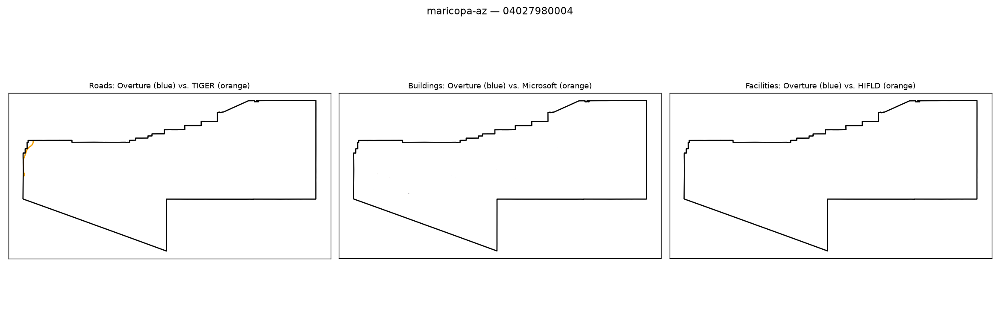

# Gold-standard validation — maricopa-az / 04027980004

**Strata**: tribal=False, rural=True, svi_high=unavailable (svi_covered=False for this tract), water_dominated=False

**Pipeline's own computed values for this tract** (from `src.gaps.score_all_regions()`, current default `building_gap_centroid`):

| component | value | defined |
|---|---|---|
| coverage_gap_score | 0.0010 | — |
| transport_gap | 0.0030 | True |
| building_gap | 0.0000 | True |
| poi_gap | 0.0000 | True |
| poi_gap_fire | nan | False |
| poi_gap_ems | nan | False |
| poi_gap_schools | nan | False |
| poi_gap_establishments | 0.0000 | True |

## Manual visual-agreement judgment

**Roads — AGREE.** A short orange curl appears near the top-left corner with no blue counterpart, and nothing else in the tract — a tiny, near-zero `transport_gap` (0.0030) is exactly what a single small unmatched segment in an otherwise roadless tract should produce.

**Buildings — AGREE (trivial case).** No buildings in either color anywhere in the tract; `building_gap` = 0.0000 is the same vacuous "both empty" case as tract 04019940800 above.

**Facilities — AGREE (trivial case).** No facility points at all; `poi_gap` = 0.0000 for the one defined sub-part (establishments) is again the vacuous case, with fire/ems/schools correctly left undefined rather than forced to 0.

No disagreement — small, consistent, low-population tract with a tiny genuine road gap and otherwise nothing to score.
