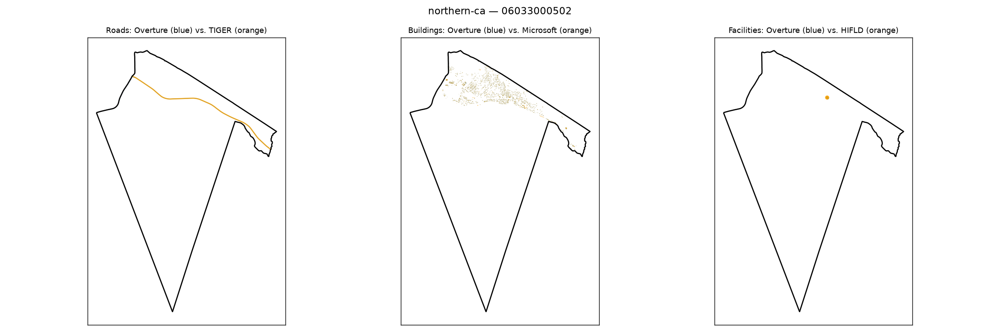

# Gold-standard validation — northern-ca / 06033000502

**Strata**: tribal=False, rural=True, svi_high=True, water_dominated=True

**Pipeline's own computed values for this tract** (from `src.gaps.score_all_regions()`, current default `building_gap_centroid`):

| component | value | defined |
|---|---|---|
| coverage_gap_score | 0.0081 | — |
| transport_gap | 0.0000 | True |
| building_gap | 0.0244 | True |
| poi_gap | 0.0000 | True |
| poi_gap_fire | 0.0000 | True |
| poi_gap_ems | nan | False |
| poi_gap_schools | nan | False |
| poi_gap_establishments | 0.0000 | True |

## Manual visual-agreement judgment

**Roads — AGREE, with a caveat worth documenting.** Only orange is visible; the most likely
explanation is Overture's near-identical geometry being fully occluded underneath TIGER's line at
`transport_gap` = 0.0000 (a near-perfect match) — not evidence of missing Overture data.

**Buildings — CORRECTED: my original "DISAGREE, flagged" note below was wrong, disproven by
follow-up investigation.** I originally read the dense orange (Microsoft) coastal-strip cluster as
Microsoft-only, with `building_gap` = 0.0244 looking implausibly low. `scripts/
debug_building_gap_centroid.py` recomputed the real counts live: **Overture has 1,521 buildings in
this tract vs. Microsoft's 1,559** — a 97.6% ratio, i.e. genuinely near-complete Overture coverage,
exactly what the low reported gap says. Centroid-vs-intersecting reassignment is also a non-factor:
100% of intersecting buildings in both sources have their centroid inside this exact tract (0
reassigned to a neighbor). This tract's Polsby-Popper compactness (0.438) is the most irregular of
the four tracts checked, so the shape-irregularity hypothesis was at least plausible to test — but
the counts show it made no actual difference here. My original visual read undercounted Overture's
presence; there is no pipeline bug.

**Facilities — AGREE (trivial case).** One orange dot only, no blue, but `poi_gap` = 0.0000 for
establishments/fire — this single point most likely belongs to an undefined sub-category
(ems/schools), consistent with the same nuance documented in south-central-tx/48323950206.

**Action**: none needed. See `docs/decision_log.md`'s Stage 7 Step 9 follow-up entry for the full
investigation record.
