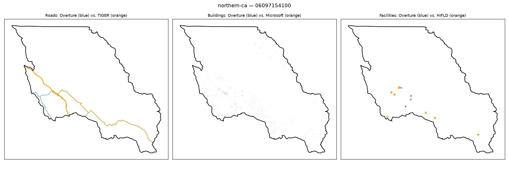

# Gold-standard validation — northern-ca / 06097154100

**Strata**: tribal=True, rural=True, svi_high=False, water_dominated=False

**Pipeline's own computed values for this tract** (from `src.gaps.score_all_regions()`, current default `building_gap_centroid`):

| component | value | defined |
|---|---|---|
| coverage_gap_score | 0.0951 | — |
| transport_gap | 0.1604 | True |
| building_gap | 0.0000 | True |
| poi_gap | 0.1250 | True |
| poi_gap_fire | 0.5000 | True |
| poi_gap_ems | nan | False |
| poi_gap_schools | 0.0000 | True |
| poi_gap_establishments | 0.0000 | True |

## Manual visual-agreement judgment

**Roads — AGREE.** Several orange segments form a network in the western part of the tract; blue overlaps a subset of them closely (partial overlap visible along two of the branches) while others (the eastern branch curving down to the south edge) appear orange-only. Partial-but-incomplete blue coverage matches a moderate `transport_gap` (0.1604).

**Buildings — AGREE (trivial-ish case).** Only faint speckle visible in either color — a genuinely sparse rural tract with very few buildings — consistent with `building_gap` ≈ 0.

**Facilities — AGREE.** A cluster of orange + blue dots overlapping in the west-central area, plus 2–3 unmatched orange dots further southeast and one far southeast corner. This mixed picture — some real overlap, some orange-only points — matches `poi_gap` = 0.1250 with `poi_gap_fire` specifically at 0.5000 (a real, partial fire-station gap), while schools/establishments show full agreement (0.0000).

No disagreement — this tract shows a believable, moderate, real coverage gap concentrated in fire stations, which is a good example for the Bias Discovery write-up of a genuine (not artifact) tribal/rural facility gap.
