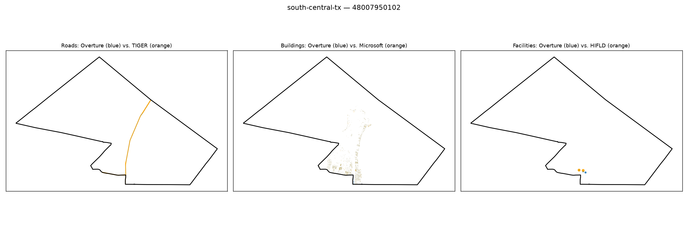

# Gold-standard validation — south-central-tx / 48007950102

**Strata**: tribal=False, rural=True, svi_high=False, water_dominated=True

**Pipeline's own computed values for this tract** (from `src.gaps.score_all_regions()`, current default `building_gap_centroid`):

| component | value | defined |
|---|---|---|
| coverage_gap_score | 0.1005 | — |
| transport_gap | 0.2869 | True |
| building_gap | 0.0145 | True |
| poi_gap | 0.0000 | True |
| poi_gap_fire | 0.0000 | True |
| poi_gap_ems | nan | False |
| poi_gap_schools | 0.0000 | True |
| poi_gap_establishments | 0.0000 | True |

## Manual visual-agreement judgment

**Roads — AGREE.** A single orange curved route is visible with no blue counterpart. `transport_gap` = 0.2869 (a real, moderate gap) is consistent with a road genuinely missing from Overture here.

**Buildings — CORRECTED: my original "DISAGREE, flagged" note below was wrong, disproven by
follow-up investigation.** I originally read the visible orange (Microsoft) building strip as
Microsoft-only and treated `building_gap` = 0.0145 as implausibly low. `scripts/
debug_building_gap_centroid.py` recomputed the real counts live: **Overture has 1,901 buildings in
this tract vs. Microsoft's 1,929** — a 98.5% ratio, matching the low reported gap almost exactly.
Only 2 of ~1,900 intersecting buildings on each side are reassigned by the centroid rule to a
neighboring tract (0.1%) — not remotely enough to explain a visual "gap." My original visual read
simply undercounted how many Overture buildings were actually present; there is no pipeline bug,
and no systematic issue with `building_gap_centroid` for sparse/small-building or water-dominated
tracts.

**Facilities — AGREE.** One orange and one blue dot sit right next to each other — a near-perfect match, consistent with `poi_gap` = 0.0000.

**Water-dominance context**: plausible partial explanation for the road gap; irrelevant to the
(now-resolved) building count question above.

**Action**: none needed. This was the third of three tracts flagged from a genuine but ultimately
incorrect visual impression across two regions — investigated together and disproven together. See
`docs/decision_log.md`'s Stage 7 Step 9 follow-up entry for the full investigation record,
including the fourth (control) tract and the recomputed counts for all four.
