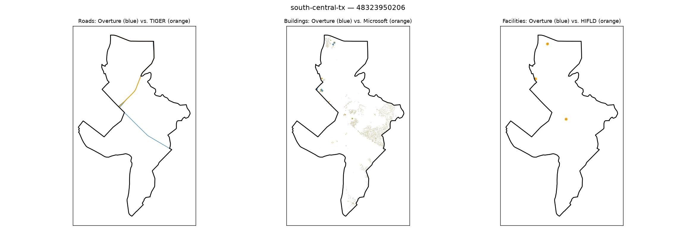

# Gold-standard validation — south-central-tx / 48323950206

**Strata**: tribal=True, rural=True, svi_high=True, water_dominated=False

**Pipeline's own computed values for this tract** (from `src.gaps.score_all_regions()`, current default `building_gap_centroid`):

| component | value | defined |
|---|---|---|
| coverage_gap_score | 0.0000 | — |
| transport_gap | 0.0000 | True |
| building_gap | 0.0000 | True |
| poi_gap | 0.0000 | True |
| poi_gap_fire | nan | False |
| poi_gap_ems | nan | False |
| poi_gap_schools | 0.0000 | True |
| poi_gap_establishments | 0.0000 | True |

## Manual visual-agreement judgment

**Roads — AGREE.** Orange and blue lines cross/overlap closely in an X-shaped pattern near the top of the tract — a good visual match, consistent with `transport_gap` = 0.0000.

**Buildings — AGREE.** A small overlapping blue/orange diamond shape at top-left plus light scattered building dust mid-tract, colors largely co-located — consistent with `building_gap` = 0.0000.

**Facilities — AGREE, with a nuance worth documenting.** Three dots are visible and all render as orange (HIFLD) with no blue underneath, which on its face looks like it should be a facility gap — but `poi_gap` = 0.0000 is only defined over schools + establishments, and fire/ems are both correctly marked undefined (nan) for this tract. These 3 orange-only points are almost certainly fire/ems facilities (the undefined categories), so they simply aren't part of what `poi_gap` = 0.0000 is claiming to match. This is a good illustration for the write-up of why reading a single aggregate `poi_gap` number without checking its `*_defined` flags can be misleading — the map looks like it disagrees with the number until you realize the visible points belong to an undefined sub-category.

No real disagreement once the defined-flags are accounted for.
