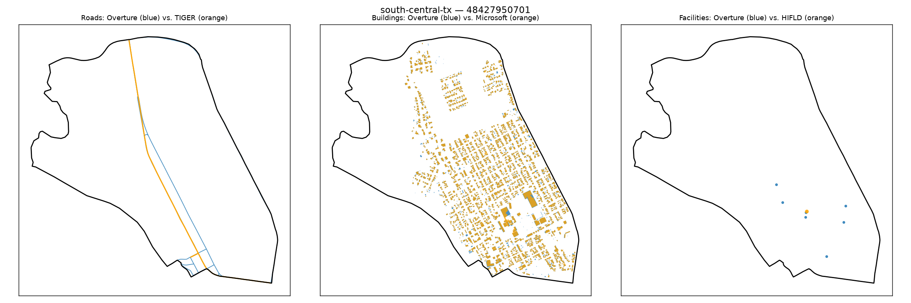

# Gold-standard validation — south-central-tx / 48427950701

**Strata**: tribal=False, rural=True, svi_high=True, water_dominated=False

**Pipeline's own computed values for this tract** (from `src.gaps.score_all_regions()`, current default `building_gap_centroid`):

| component | value | defined |
|---|---|---|
| coverage_gap_score | 0.0000 | — |
| transport_gap | 0.0000 | True |
| building_gap | 0.0000 | True |
| poi_gap | 0.0000 | True |
| poi_gap_fire | nan | False |
| poi_gap_ems | nan | False |
| poi_gap_schools | 0.0000 | True |
| poi_gap_establishments | 0.0000 | True |

## Manual visual-agreement judgment

**Roads — AGREE.** Orange and blue trace almost the identical path down the middle of the tract, appearing as a single thickened line where they overlap — a clean visual match for `transport_gap` = 0.0000.

**Buildings — AGREE.** This is the densest, most urban-looking tract in the set — hundreds of building footprints, and both blue and orange are densely present and spatially co-located across the whole built-up area, not segregated into separate clusters like the flagged tracts above. `building_gap` = 0.0000 is well supported here.

**Facilities — AGREE.** Multiple blue dots plus one larger overlapping blue+orange dot near the center — Overture clearly has essentially full coverage of what HIFLD has, consistent with `poi_gap` = 0.0000.

No disagreement — this is the strongest "genuinely well-covered urban tract" example in the set, and useful as a contrast case against the three flagged building_gap tracts: here the buildings visually co-locate, there they don't, yet the reported building_gap is near-zero in both situations. That contrast itself is the evidence supporting the building_gap concern raised in the other three notes.
